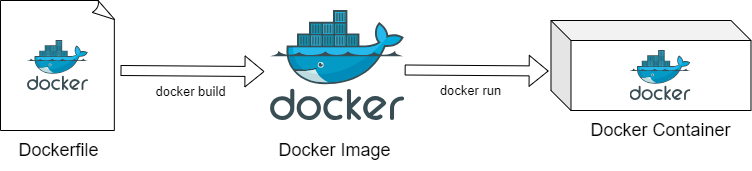

---

marp: true
theme: default
paginate: true
--------------

<!-- slide: title -->

# Warum Docker Images bauen?

* 📦 **Apps ausliefern**, unabhängig von der Umgebung
* 🔧 **Vorhandene Images anpassen** für Unternehmensanforderungen

  * z. B. interne Tools installieren
  * Eigene **Root-CA-Zertifikate** einfügen

---

# Was ist ein Dockerfile?

Ein **Dockerfile** ist eine Sammlung von Anweisungen zum automatisierten Erstellen eines Images.

Darin definierst du:

* welches Basis-Image verwendet wird
* welche Dateien kopiert werden
* was installiert werden soll
* wie der Container gestartet wird

Man kann es sich wie ein **Rezept zum Bauen eines Images** vorstellen.

---

# Docker Build Syntax

Um ein Docker Image zu bauen, verwende:

```bash
docker build -t <image-name> <build-context>
```
Beispiel:
```bash
docker build -t my-app .
```

- `-t <image-name>` gibt dem Image einen Namen (Tag)
- `<build-context>` ist meist der aktuelle Ordner (`.`)

---

# Vom Dockerfile zum Container




Dieser Ablauf beschreibt, wie aus Quellcode und Instruktionen ein laufender Container wird.

---

# Zentrale Dockerfile-Befehle

---

# `FROM` – Basis-Image wählen

Definiert, auf welchem Image dein neues Image basiert.

Beispiel:

```dockerfile
FROM alpine:3.20
```

* Muss der **erste Befehl** im Dockerfile sein
* Kann ein offizielles Image oder ein eigenes sein
* Du kannst mehrere `FROM` verwenden (für Multi-Stage Builds)

---

# `COPY` – Dateien ins Image übernehmen

Kopiert Dateien vom Build-Kontext ins Image.

Beispiel:

```dockerfile
COPY ./src /app
```

* Relativ zum Pfad, in dem der Build gestartet wird
* Zielpfad muss im Image existieren oder wird erstellt

---

# `RUN` – Kommandos zur Build-Zeit ausführen

Führt Shell-Kommandos beim Erstellen des Images aus.

Beispiel:

```dockerfile
RUN apt-get update && apt-get install -y curl
```

* Wird **während des Builds** ausgeführt

---

# `CMD` – Standardstartbefehl des Containers

Legt fest, was ausgeführt wird, wenn der Container startet.

Beispiel:

```dockerfile
CMD ["echo", "Hello World"]
```

* Es kann nur **ein CMD** geben (der letzte zählt)
* Kann beim `docker run` überschrieben werden
* Nutzt entweder **Exec-Form** (`["node", "app.js"]`) oder Shell-Form (`CMD echo Hello`)

---

# `WORKDIR` - Arbeitsverzeichnis im Image

Setzt das Verzeichnis, in dem alle nachfolgenden Befehle ausgeführt werden

```dockerfile
WORKDIR /app
```

* Das Verzeichnis wird angelegt, wenn es nicht existiert
* Mehrfaches aufrufen von `WORKDIR` ist erlaubt und ändert den Pfad.

---

# Kurzübersicht der 5 Dockerfile-Befehle

- `FROM`: Legt das Basis-Image fest, auf dem das neue Image aufbaut.

- `COPY`: Übernimmt Dateien aus dem lokalen Kontext ins Image.

- `RUN`: Führt Befehle während des Builds aus, z. B. zur Installation von Software.

- `CMD`: Definiert den Standardbefehl, der beim Starten des Containers ausgeführt wird.

- `WORKDIR`: Setzt das Verzeichnis für die weiteren Befehlen.

---

# 🧪 Übung 1 - Einfaches Docker Image erstellen

- Wechsel in den Ordner examples/example-1
- Ergänze die Dockerfile, das:  
  - die `index.js` und `packages.json` ins Image kopiert wird
  - im Image `npm install`
  - Beim Start des Containers die Anwendung `node` mit der `index.js` aufgerufen wird
- Baue und starte das Image

Erwartete Ausgabe:
```bash
🚀 Welcome to your first Dockerized Node.js app!
```


---

# Wie funktionieren Layer & Caching?

Docker baut Images **Schritt für Schritt**, jede Anweisung erzeugt einen **Layer**.

* Jeder Layer wird **zwischengespeichert (Cache)**.
* Wenn sich ein Layer nicht ändert, wird der Cache verwendet.
* Änderungen **brechen das Caching** ab dem ersten veränderten Layer.

---

## Beispiel: Layer-Verhalten

```dockerfile
COPY package.json .     # Layer 1
RUN npm install         # Layer 2
COPY . .                # Layer 3
```

💡 Ändert sich `package.json`, wird `npm install` neu ausgeführt.
Ändert sich nur der Code, wird Layer 2 gecached.

**➡️ Reihenfolge der Befehle = Performancefaktor!**

---

# 🔐 Root vs. Non-Root

Standardmäßig läuft der Container als **root**.

Risiken:

* Sicherheitslücken (root inside Container ≠ sicher)
* Keine Rechtebeschränkung gegenüber dem Container-Dateisystem

---

## Lösung: Benutzer anlegen

```dockerfile
RUN useradd -m appuser
USER appuser
```

* `USER` schaltet auf anderen Benutzer um
* Best Practice für Produktions-Container
* Manche Images haben bereits `non-root` Nutzer vorinstalliert

---

# Was ist der Build-Kontext?

Der **Build-Kontext** ist der Ordner, den du an `docker build` übergibst:

```bash
docker build -t my-image .
```

➡️ Hier: `.` = aktueller Ordner

* Alle Pfade im Dockerfile (z. B. `COPY`) beziehen sich auf diesen Kontext.
* Nur Dateien **im Kontext** können ins Image kopiert werden.
❌ Du kannst NICHT einfach ../../irgendwas kopieren – alles außerhalb des Build-Kontexts ist für Docker unsichtbar!

---

# .dockerignore – wie .gitignore für Docker

Du willst keine `.git`, `node_modules`, `secrets.txt`, etc. im Image?
Dann sag Docker: "Ignorier das bitte."

`.dockerignore`:

```
node_modules
.git
secrets.txt
```

Vorteile:

* Build schneller
* Images kleiner
* Keine versehentliche Leaks von Daten

---

# 🧪 Übung 2 – Diese Dockerfile ist schrecklich!

Das Ding läuft als root. Es wird nicht gecached. Es übernimmt Debug-Dateien mit hinein.

Fix it!

Simuliere Code-Änderungen und erstelle das Image neu:
`"" >> index.js && docker build -t safe-node-app .`
`docker run --rm safe-node-app`

➡️ Erwartete Ausgabe:

✅ App is running!

---

# Dockerfile: ENV & HEALTHCHECK

**ENV** – Setzt Umgebungsvariablen im Container
```dockerfile
ENV NODE_ENV=production
```

**HEALTHCHECK** – Prüft, ob der Container "gesund" ist
```dockerfile
HEALTHCHECK CMD curl --fail http://localhost:8080 || exit 1
```

---

# Dockerfile: EXPOSE & VOLUME (optional)

**EXPOSE** *(optional)* – Dokumentiert, welche Ports der Container nutzt (nur als Hinweis, kein Muss)
```dockerfile
EXPOSE 8080
```

**VOLUME** *(optional)* – Definiert einen Speicherort für persistente Daten (nur als Empfehlung)
```dockerfile
VOLUME /data
```

Nur das Wichtigste – Details und Best Practices gibt es später!

---

# Image Taggen

Bevor du ein Image pushen kannst, musst du es mit einem Tag versehen.

**Syntax:**
```bash
docker tag <image> <registry>/<user>/<repo>:<tag>
```
Beispiel:
```bash
docker tag my-app docker.io/myuser/my-app:latest
```

---

# Image Pushen

Ein **Registry** ist ein zentraler Speicherort für Docker Images (z.B. Docker Hub, GitHub Container Registry, private Registry).

**Syntax:**
```bash
docker push <registry>/<user>/<repo>:<tag>
```
Beispiel:
```bash
docker push docker.io/myuser/my-app:latest
```

*Images müssen vor dem Push getaggt werden!*

---

# Multistage Build (Erklärung)

Mit **Multistage Builds** kannst du mehrere `FROM`-Anweisungen in einem Dockerfile nutzen, um Images effizienter und schlanker zu bauen.

**Syntax:**
- Mehrere `FROM <image> AS <name>` Abschnitte
- Mit `COPY --from=<name>` kannst du gezielt Dateien aus vorherigen Stages übernehmen

**Vorteile:**
- Nur die wirklich benötigten Dateien landen im finalen Image
- Build-Tools und Abhängigkeiten bleiben draußen
- Images werden kleiner und sicherer


---

# Base Images (advanced)

| Type                | Description                        | Use Case                              | Example                                                |
| ------------------- | ---------------------------------- | ------------------------------------- | ------------------------------------------------------ |
| `scratch`           | Empty.                | Final stage for compiled binaries     | `FROM scratch`                                         |
| `busybox`, `alpine` | Minimal Linux         | Small containers, simple scripts      | `FROM busybox`, `FROM alpine`                          |
| SDK/Runtime Images  | Full-featured language stack       | Build & run apps (Java, .NET, Python) | `FROM openjdk:17` |
| `distroless`        | Runtime-only, no shell, no baggage | Secure production deployments         | `FROM gcr.io/distroless/java`                          |

---

# `ENTRYPOINT` – Nur für Fortgeschrittene

`ENTRYPOINT ["node"]`  
`CMD ["index.js"]`

Nutze `ENTRYPOINT`, wenn du genau kontrollieren willst, **was** immer beim Start ausgeführt wird.

➡️ Kombinierbar mit `CMD` für Argumente  
➡️ Wird **nicht** so leicht überschrieben wie `CMD`

💡 Für später, wenn du Wrapper-Skripte oder Tools baust
